# How to Create an Episode

This document will explain to you how to produce an episode.

## Create the Checklist

Start by copying the following into the issue for the episode. Check things off as you do them.

```markdown

Prep:
- [ ] Pick a topic and create/use an issue in this repo
- [ ] If applicable, coordinate with others that will be on the show (guests, other teams, etc.)
- [ ] Create the thumbnail for the episode
- [ ] Schedule the live stream on Youtube
    - [ ] Title: `Community Office Hour - TITLE HERE`
    - [ ] Fill in desciption with a brief explanation of what will be presented
- [ ] Add scheduled episode to the "Community Office Hours" playlist
- [ ] Tweet about it from the Concourse account and/or your own Twitter account
    - [ ] Share tweet link in #dev channel on discord
    - [ ] Share tweet link in slack channels (#concourse-vmware, #concourse-runway, #mapbu-rd-toronto, etc.)

Before Going Live:
- [ ] Do not do any software/OS updates!
- [ ] Hide your bookmark bar if you'll be showing your browser
- [ ] Test all scenes in OBS, verifying that visuals and audio are working as expected

After The Show:
- [ ] 

```

## Scheduling the Live Stream

1. Ensure you're logged into the correct Youtube account
  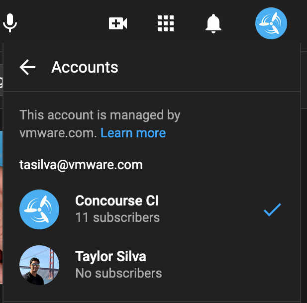

2. [Schedule a new event by clicking here](https://studio.youtube.com/channel/UCf5gRGP0pYASo1YwoBkaCGw/livestreaming/manage)
  (or Youtube Studio > Create > Go Live > Manage > Schedule Stream)

3. Select the previous episode and click "Reuse settings"
  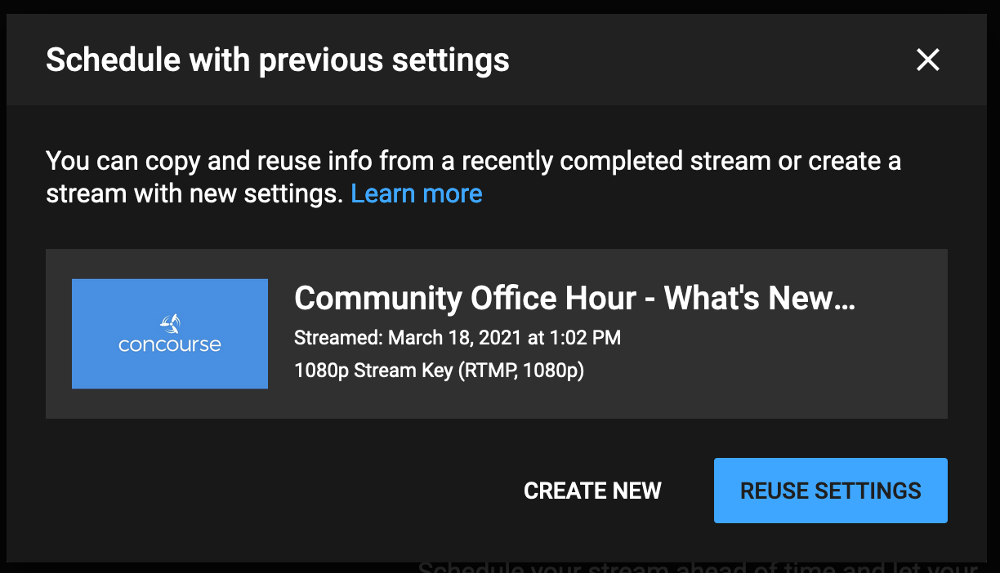

4. Fill in Name, Description, Thumbnail, Time (ensure time is set to start at 1pm EST)
  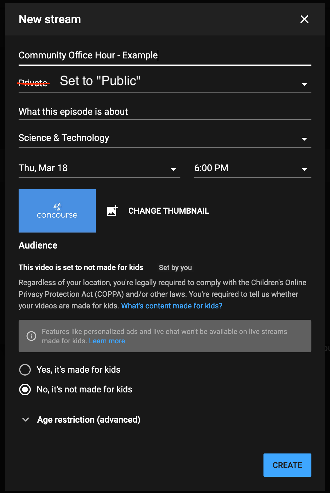

5. Copy the stream key to put in OBS (OBS > Settings > Stream > Streaming Key)
  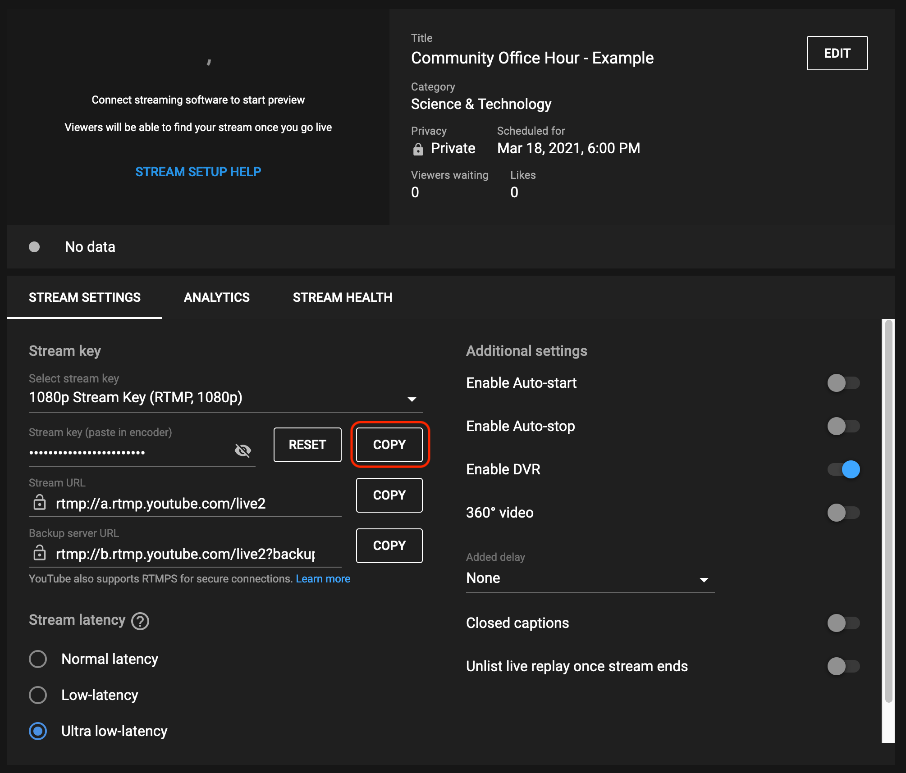

6. Get the chat ID for the stream by popping out the chat on the right-side and copy the value of `v=` in the URL
  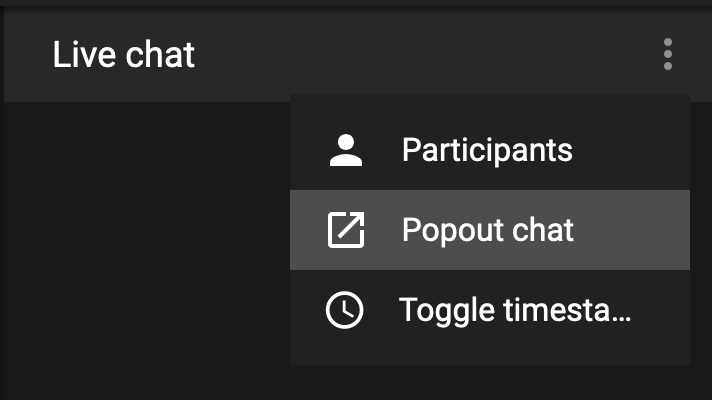
  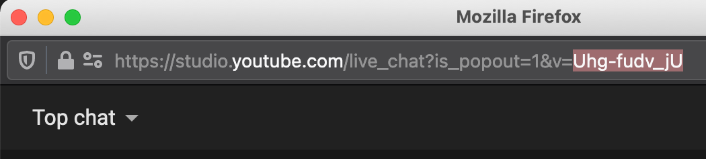
  Update the `v=` in the `Youtube Chat Window` source in OBS
  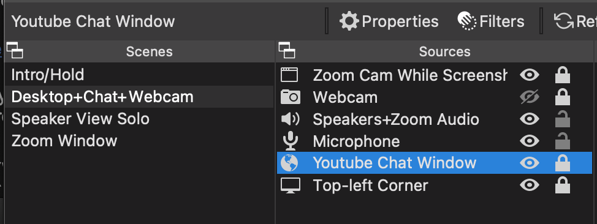
  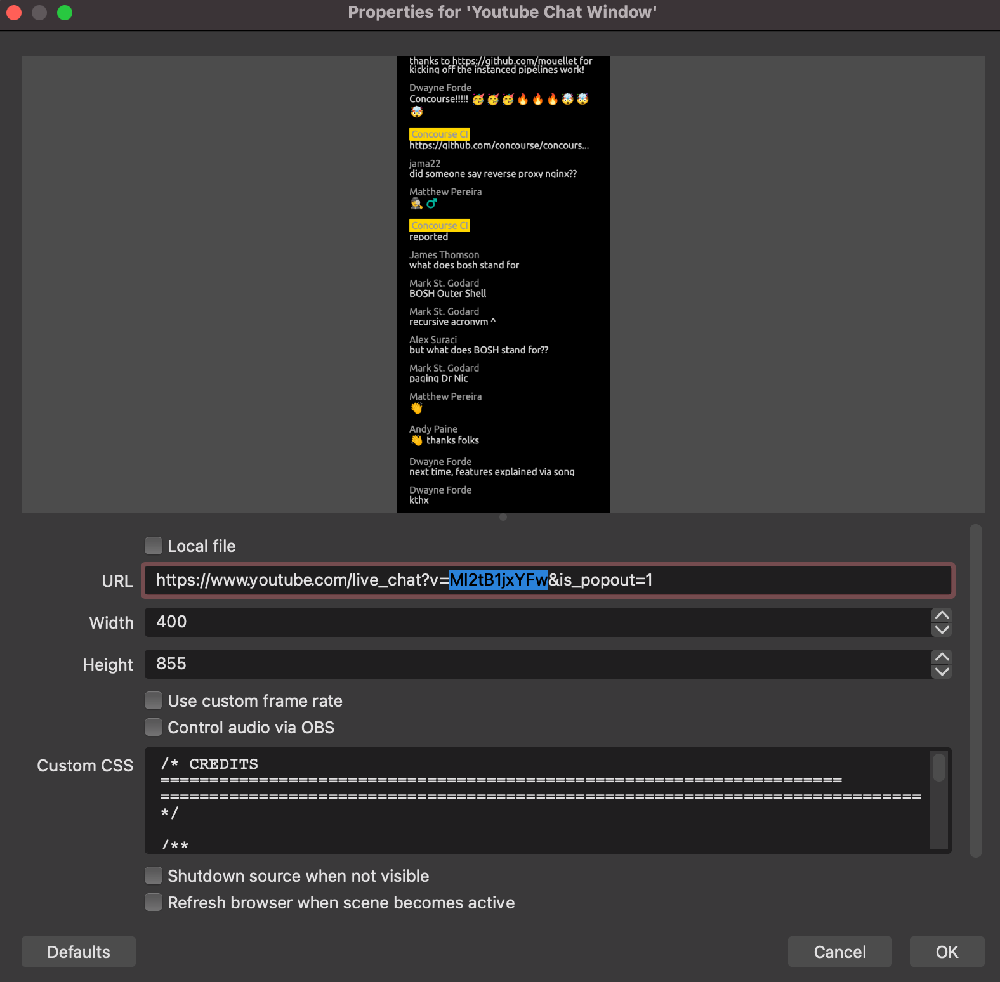

7. Add the stream to the "Community Office Hours" playlist
  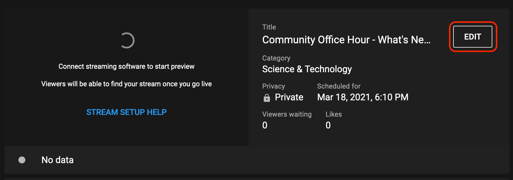
  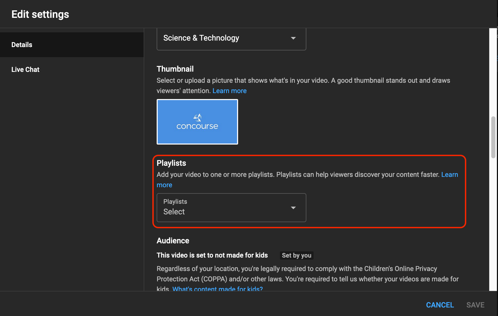

## Setting Up OBS

1. If you're going to have guests join you via Zoom or some other tool follow [this guide to setup audio capture on macOS](https://obsproject.com/forum/resources/os-x-capture-audio-with-ishowu-audio-capture.505/).

2. Import the OBS profile and scene from this repo
  - `Profile > Import` and choose `obs-config/profiles/Concourse`
  - `Scene Collection > Import` and choose `obs-config/scenes/Concourse_Community_Stream_macos.json`

3. After importing, ensure the correct Profile and Scene are selected. At this point you'll need to look through all the scenes and adjust things to work for your computer. There's too much to explain here so please reach out for help if you get stuck on something.

4. In OBS, ensure the Video Bitrate is between `4000-6000 Kbps`. This ensures the stream comes out at 1080p
  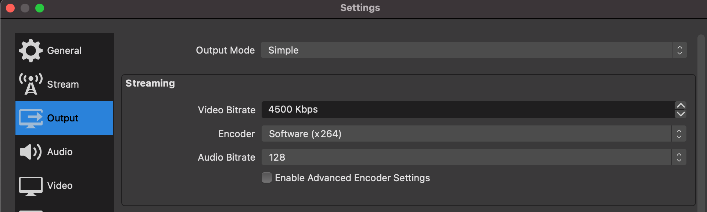

## Testing the Stream

1. [Click here](https://studio.youtube.com/channel/UCf5gRGP0pYASo1YwoBkaCGw/livestreaming) or go to `Youtube Studio > Create > Go Live > Manage` and select your stream.

2. In OBS press `Start Streaming`. It'll take a few seconds for the preview to show up and is ~5s behind. The video preview is also capped at 360p.

3. Verify that the connecting is "Excellent" (will dislpay under the video preview). You can also test out that chat appears correctly in OBS when you enter messages in the live chat window. You can delete your messages after testing.
